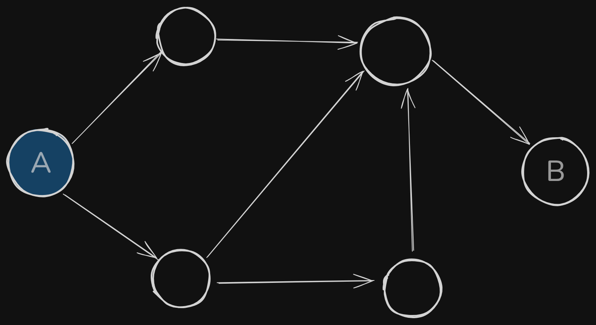
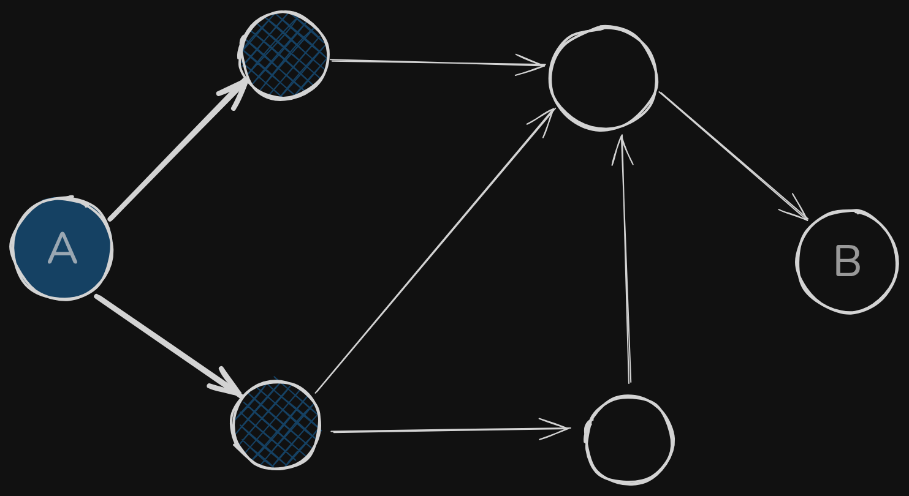
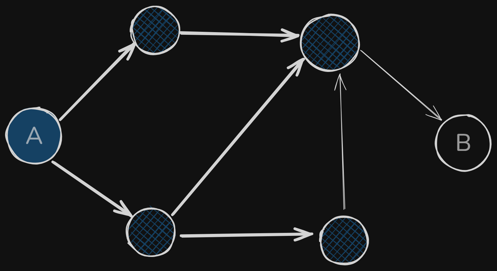
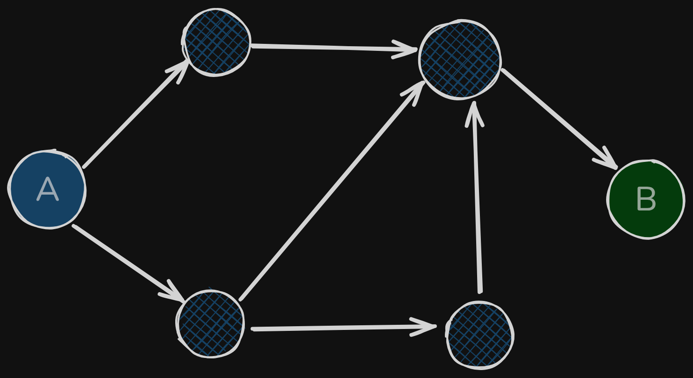
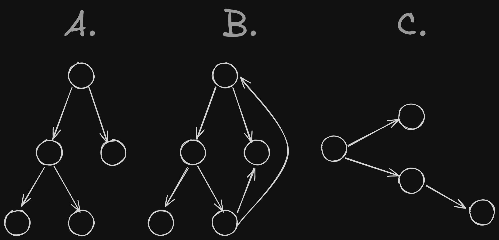

This chapter will introduce graphs, and then a graph algorithm called *breadth-first search* (BFS). This algorithm allows us to find the shortest distance between two nodes in a graph; but *distance* can be abstracted to mean a number of ways. We can use breadth-first search to
* Write a spellchecker (fewest edits from misspelled word to real word; READED $\rightarrow$ READER is one edit away)
* Find the doctor closest to us in our network
* Build a search engine crawler.

As we will see, graph algorithms are among the most useful algorithms.

# Introduction to graphs

Consider the following problem. We want to go from point A to point B, and we want to get there by bus, with a minimum number of transfers. Can we think of an algorithm to find the path with the fewest steps?



Can we get there in one step? If we highlight all the places we can get to in one step, we will see that point B is not highlighted.



Can we get there in two steps?



What about three?



Yes! We can infer that the path that minimizes the number of transfers is the highlighted one, which takes 3 steps. There are other routes to get to our destination, but they are longer.

This type of problem is called a *shortest-path problem*, and the algorithm to solve it is called *breadth-first search*. Generally, the steps to solve such a problem are:
  1) Model the problem as a graph
  2) Solve the problem using breadth-first search

# What is a graph?

A graph models a set of connections, and they are made of *nodes* (entities) and edges (*the connections*). A node can be directly connected to other many nodes, which are called *in-neighbors* or *out-neighbors*, depending on whether the are pointing *towards* or *away from* the node.

* A $\rightarrow$ B
* A is an in-neighbor of B
* B is an out-neighbor of A

# Breadth-first search

In chapter 1 we looked at a search algorithm, binary search. Breadth-first search is different, in that in runs on graphs. It can help answer two types of questions:
* Question type 1: Is there a path from node A to node B?
* Question type 2: What is the shortest path from node A to node B?

In the beginning of this chapter we saw an example of a question of type 2 (what is the shortest path?). Now, let us look at the algorithm in more detail, and ask a question of type 1 (is there a path?).

Suppose you want to know whether you are connected to someone on a particular network, say, your group of friends (in other words, is there a path between you and the person you are interested in?).

1) Let us start with your own friends. Is the person you are interested your direct friend? If not, let us widen the search to include the friends of your friends.
2) Is any of your friends' friends the person you are interested in? If not, let us widen the search to icnlude the friends of your friends' friends.
3) ...


## Finding the shortest path

After answering question 1 (is there a path?), let us try to answer question 2 (what is the shortest path?).

We would prefer a first-degree connection to a second-degree connection, and a second-degree connection to a third-degree one. More generally, this means that we should not search any N-degree connections before we are sure that we do not have a (N-1)-degree connection to our node (person) of interest.

Breadth-first search works by radiating out from our starting point and sequentially adding items to a *search list*. Thus, (N-1)-degree connections will be added to the *search list* before N-degree connections.

Notice how this only works if we search nodes in the same order in which they are added to our list. There is a data structure for this: a *queue*.

## Queues

Queues are similar to stacks, in that you cannot access random elements in the queue. Instead, there are only two operations, *enqueue* (add to the end) and *dequeue* (take from the start). If we enqueue two items, the first one will be dequed before the second one.

The queue is a FIFO (First In, First Out) data structure, while the stack is a LIFO (Last In, First Out) data structure.

# Implementing the graph

A graph consists of several nodes. Each node is connected to other nodes. We can represent this relationship thanks to *hash tables*. In this case, we will use them to map a node to all of its out-neighbours.

For example
```
  A
 / 
O - B
 \
  C
```

Can be represented as

```python
graph = {}
graph['O'] = ['A', 'B', 'C']
```

It does not matter in which order we add the key/value pairs in, since dictionaries are not ordered.

A, B, and C have in-neighbours but no out-neighbours, which defines a *directed graph*. In this type of graph, relationships follow a specific direction. In contrast, an *undirected graph* lacks this directionality, with all relationships being reciprocal. In such a graph there are only *neighbors*.

# Implementing the algorithm

To recap, this is how the implementation will work

1) Keep a queue containing the people to check
2) Pop a person off the queue
3) Check if the person is the one we are interested in
    * 3.1) Yes $\rightarrow$ we are done!
    * 3.2) No $\rightarrow$ Add all their neighbours to (the end of) the queue
4) Go back to step 2
5) If the queue is empty there is no path to the person of interest

In Python, we can use a double-ended queue (deque)

```python
from collections import deque
# create a new queue
search_queue = deque()

# add all the out-neighbors of the starting point (us)
# to the search queue
search_queue += graph["you"]
```

And here is the rest of the implementation

```python
# while the search queue is not empty
while search_queue:
    # let us get the first person off the queue
    person = search_queue.popleft()

    # are they are who we were looking for?
    if person_is_of_interest(person):
        print(f"Person {person} is who we were after!")
        return True
    # if not, add all of their friends to the queue
    else:
        search_queue += graph[person]
# there is no path between us and that person
return False
```

we also need a function to check whether a given person is who we were looking for

```python
def person_is_of_interest(person):
    return person == 'Faust'
```

An additional important consideration is that we should not check the same node twice. It is inefficient, and in the worst case, it could lead to an infinite loop! In order to avoid this, we should keep track of the nodes that have already been visited.

Here is the final code for breadth-first search:


```python
# let us define the graph first
graph = {}
graph['you'] = ['anthony', 'antonio', 'tony']
graph['anthony'] = ['you', 'antonio']
graph['antonio'] = ['tony']
graph['tony'] = ['anthony', 'Faust']
graph['faust'] = []
```


```python
from collections import deque
# create a new queue
search_queue = deque()

# define our checking function
def person_is_of_interest(person):
    return person == 'Faust'

# add all the out-neighbors of the starting point (us)
# to the search queue
search_queue += graph["you"]

def search(name):
    search_queue = deque()
    search_queue += graph[name]
    # this set will keep a record of which nodes we have visited
    searched = set()
    while search_queue:
        print(search_queue)
        person = search_queue.popleft()
        if not person in searched:
            if person_is_of_interest(person):
                print(f"Person {person} is who we were after!")
                return True
            else:
                search_queue += graph[person]
                searched.add(person)
    return False
```


```python
search('you')
```

    deque(['anthony', 'antonio', 'tony'])
    deque(['antonio', 'tony', 'you', 'antonio'])
    deque(['tony', 'you', 'antonio', 'tony'])
    deque(['you', 'antonio', 'tony', 'anthony', 'Faust'])
    deque(['antonio', 'tony', 'anthony', 'Faust', 'anthony', 'antonio', 'tony'])
    deque(['tony', 'anthony', 'Faust', 'anthony', 'antonio', 'tony'])
    deque(['anthony', 'Faust', 'anthony', 'antonio', 'tony'])
    deque(['Faust', 'anthony', 'antonio', 'tony'])
    Person Faust is who we were after!


    True


## Running time

Searching the entire network means we will follow each edge, meaning the running time will be at least O(number of edges). We also keep a queue of every person to search. Adding one person to the queue takes constant time, so doing this for every person will take O(number of people) in total.

Breadth-first search takes O (number of people + number of edges), and it is more commonly written as $O(V+E)$ (V for number of vertices; E for number of edges)

# Exercises

Run the breadth-first search algorithm on each of these graphs to find the solution.

**6.1**) Find the length of the shortest path from start to finish
```
   O ------> F
 /   \       ^
S     O      |
 \   /       |
   O ------> O
```
**Answer**: The shortest path is the top of the network, which puts 2 edges and 1 node between start (S) and finish (F)

**6.2**) Find the length of the shortest path from "cab" to "bat"

```
         MAT ------|
          |        |
   /-----CAT ---> BAT
  /       |        |
 /        |        |
CAB ---> CAR ---> BAR
```

**Answer**: The shortest path is CAB -> CAT -> BAT, which has a length of 1 node (or two edges).

Here is a graph of a morning routine

```
          < Shower
         /
Wake up <
         \
          < Brush teeth < --- Eat breakfast
```

Given the dependencies that the graph represents, we can make a list of the order in which these activities will be fullfilled.
1) Wake up
2) Shower
3) Brush teeth
4) Eat breakfast

We the following is also valid
1) Wake up
2) Brush teeth
3) Shower
4) Eat breakfast

**6.3**) For these three lists, mark whether each one is valid or invalid

List A
1) Wake up
2) Shower
3) Eat breakfast
4) Brush teeth

**Answer**: Invalid, we cannot eat breakfast before brushing teeth

List B
1) Wake up
2) Brush teeth
3) Eat breakfast
4) Shower

**Answer**: Valid

List C
1) Shower
2) Wake up
3) Brush teeth
4) Eat breakfast

**Answer**: Invalid, we cannot shower before waking up!

**6.4**) Here is a larger graph. Make a valid list for this graph

```
          < Exercise <--- Shower <--- Get dressed
         /
Wake up < --- Brush teeth <--- Eat breakfast
         \
          < Pack lunch

```

**Answer**: A potential valid list could be
* Wake up
* Exercise
* Shower
* Get dressed
* Brush teeth
* Eat breakfast
* Pack lunch

In a way, this list is sorted. If task A depends on task B, task A shows up later in the list. This is called a *topological sort*, and it is a way to make an ordered list out of a graph.

This has many applications, as for example, topologically sorting a graph full of tasks to find out a tasks to start with.

**6.5**) Suppose you have a family tree which shows people as nodes connected directionally in from their ancestors and out to their offspring. Such a data structure is a graph, but notably, none of the nodes of a given generation points towards the previous generation; such a graph is called a *tree*.

Which of the following graphs are also trees?




**Answer**: A) and C)
