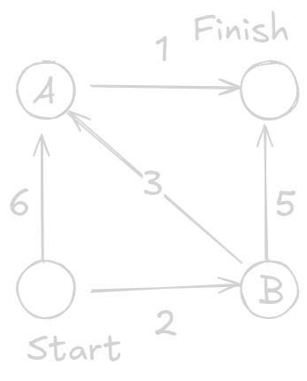
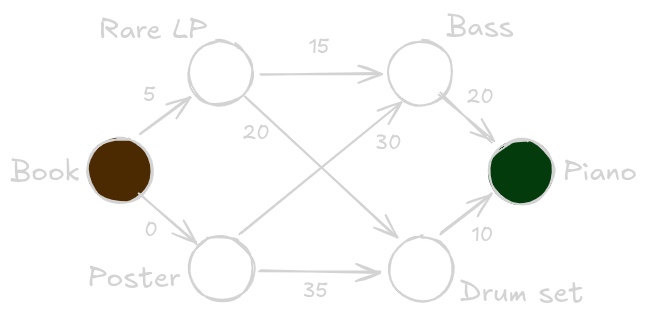
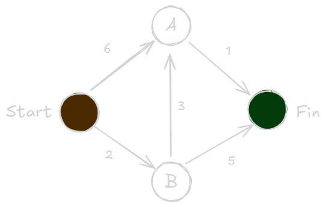
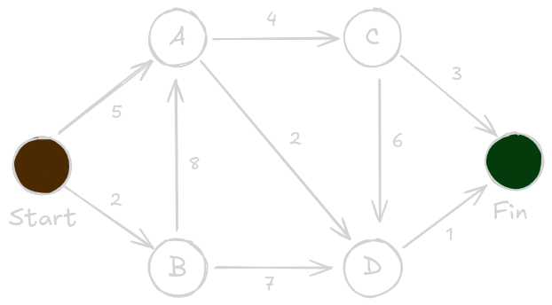

# Working with Dijkstra's algorithm

Let us introduce Dijkstra's algorithm with an example problem. Below there is a *directed weighted graph* (section on terminology below). Each segment features an associated value, which we can think of as a *cost* to traverse it, such as a measure of time (e.g., minutes). Can we calculate the *fastest* (least cost) path between Start and Finish?



With breadth-first search, we could get the shortest path in terms of *fewest* segments traversed, such as [ Start $\rightarrow$ A / B $\rightarrow$ Finish ]. But with Dijkstra's algorithm, we can obtain the *fastest* path, by incorporating the weights of the segments into the computation. The algorithm can be explained in four steps:

1) Find the "cheapest" node. This is the node we can get to in the least amount of time.
> If we begin in Start, we could go to node A (6) or node B (2). Since we do not have information about any other nodes, we can think of them as having an "infinite" cost.
>
> | Node | Time to node |
> |-----------|-----------|
> | A         |      6    |
> | B         |      2    |
> | Finish    |  $\infty$ |
> 
2) Update the costs of the out-neighbors of this node (B).
>If we reach A from B, the total cost is 5!<br>
>If we reach Finish from B, the total cost is 7<br>
>Let us update the table
>
> | Node | Time to node |
> |-----------|-----------|
> | A         |      5    |
> | B         |      2    |
> | Finish    |      7    |
> 
3) Repeat until we have done this for every node in the graph.
>Since we have already updated the out-neighbours of the Start node and of the node B, we shall do node A next.<br>
>If we reach the Finish node from A, the total cost is 2+3+1 = 6!<br>
>
> | Node | Time to node |
> |-----------|-----------|
> | A         |      5    |
> | B         |      2    |
> | Finish    |      6    |
> 
4) Calculate the final path.
>In order to calculate the most optimal path, we should have stored the most optimal "parent" node, together with the most optimal cost. Oops. Ah well, we will do that in the code section.

Thanks to Dijkstra's algorith, we have found the fastest path (lowest total cost) from the Start node to the finish node!

# Terminology

*Weighted graph*: A graph in which the edges feature an associated value, or *weight*.

*Unweighted graph*: A graph without weights.

To calculate the shortest path in an unweighted graph, use *breadth-first search*

To calculate the shortest path in a weighted graph, use *Dijkstra's algorithm*.

Graphs can have *cycles*. A cycle is a set of connected nodes such that we can traverse them indefinitely.

In an undirected graph, each edge can be thought of as a cycle, since they can be traversed in both direction. Dijkstra's algorithm only works on graphs with no cycles, and where all the edges are nonnegative.

To determine the fastest path between two nodes in a graph with negative weight edges, use the Bellman-Ford algorithm.

# Trading for a piano

Graphs do not necessarily reflect spatial locations, and thus weights can represent many types of costs. Consider the following example.

We own a book, and we want to trade our way to a piano. Below there is a graph which represents a series of trades we can do, in terms of how much money we have to pay to perform the trade. What sequence of trades will get us the piano at the lowest possible cost?

For this, we will apply the Dijkstra algorithm and record which is "parent" node is the cheapest to reach each node.



**Step 1**
* From node "Book", we check the out-neighbors "Rare LP" and "Poster"

| Parent | Node | Cost to node |
|-----------|-----------|-----------|
|   Book    | Rare LP   |     5     |
|   Book    | Poster    |     0     |
|    -      | Bass      | $\infty$  |
|    -      | Drum set  | $\infty$  |
|    -      | Piano     | $\infty$  |


**Step 2**
* From node "Poster" (cheapest node), we check the out-neighbors "Bass" and "Drum set"

| Parent | Node | Cost to node |
|-----------|-----------|-----------|
|   Book    b| Rare LP   |     5     |
|   Book    | Poster    |     0     |
|  Poster   | Bass      |    30     |
|  Poster   | Drum set  |    35     |
|    -      | Piano     | $\infty$  |


**Step 3**
* From node "Rare LP" (next cheapest node), we check the out-neighbors "Bass" and "Drum set"
* Oh! By traversing through the "Rare LP", there is a cheapet way of getting to the "Bass" and to the "Drum set"! Let us update their cost and their parent node

| Parent | Node | Cost to node |
|-----------|-----------|-----------|
|   Book    | Rare LP   |     5     |
|   Book    | Poster    |     0     |
|  Rare LP  | Bass      |    20     |
|  Rare LP  | Drum set  |    25     |
|    -      | Piano     | $\infty$  |


**Step 4**
* From node "Bass" (next chapest node), we check the out-neighbor "Piano", which is our intended final node

| Parent | Node | Cost to node |
|-----------|-----------|-----------|
|   Book    | Rare LP   |     5     |
|   Book    | Poster    |     0     |
|  Rare LP  | Bass      |    20     |
|  Rare LP  | Drum set  |    25     |
|   Bass    | Piano     |    40     |


**Step 5**
* From node "Drum set" (next cheapest node), we check the out-neighbor "Piano", to check whether the total cost is lower.
* It is!

| Parent | Node | Cost to node |
|-----------|-----------|-----------|
|   Book    | Rare LP   |     5     |
|   Book    | Poster    |     0     |
|  Rare LP  | Bass      |    20     |
|  Rare LP  | Drum set  |    25     |
|  Drum set | Piano     |    35     |


**Step 6**

Now that we have no nodes left to check, we can be sure that the best way to trade from the Book to the Piano will cost us 35. But what is this best way (proverbial path)? For this, we simply have to backtrack the path we have chosen by using the table.

* Piano
* Piano $\leftarrow$ Drum set
* Piano $\leftarrow$ Drum set $\leftarrow$ Rare LP
* Piano $\leftarrow$ Drum set $\leftarrow$ Rare LP $\leftarrow$ Book!

This example illustrates the fact that although we have used the term "shortest path" literally, it can represent any arbitrary cost of traversal, such as, in this case, value.

# Negative-weight edges

Dijkstra’s algorithm fails on graphs with negative-weight edges because it assumes that once a shortest distance to a node is chosen, it can never be improved. Negative edges can create shorter paths after a node has been finalized, breaking this assumption. As a result, Dijkstra may produce incorrect results. Thus, for these kinds of graphs, algorithms like Bellman–Ford must be used instead.

# Implementation

In this section we will implement Dijkstra's algorithm. For this example, we will use the following graph



We need to encode the graph, which we will do in a hash table (dictionary)


```python
# the format is graph[node][out_node] = cost
graph = {}

graph['start'] = {}
graph['start']['a'] = 6
graph['start']['b'] = 2

graph['a'] = {}
graph['a']['fin'] = 1

graph['b'] = {}
graph['b']['a'] = 3
graph['b']['fin'] = 5

# 'fin' node has no out neighbors
graph['fin'] = {}
```

We will also need to store the current cost of each node, its current parent, and which nodes we have already visited.


```python
# we need a measure of infinity (any number is lower than this)
import math
infinity = math.inf

# store the current cost of traversing to each node
dict_current_cost = {}
dict_current_cost['a'] = 6
dict_current_cost['b'] = 2
dict_current_cost['fin'] = infinity

# store the current parent for each node
dict_current_parent = {}
dict_current_parent['a'] = 'start'
dict_current_parent['b'] = 'start'
dict_current_parent['fin'] = None

# store which nodes we have already processed
processed = set()
```

The algorithm goes something like this

* While we have nodes to process
    * Grab the node that is closest to the start
    * Update costs for its neighbors
    * If any of the costs were updated, update the parent too
    * Mark this node as processed


```python
def find_lowest_cost_node(dict_current_cost):
    # initialization (any number will be lower than infinity!)
    lowest_cost = math.inf
    lowest_cost_node = None

    # iterate through every node and cost
    for node, cost in dict_current_cost.items():
        # if any node has a lower cost and has not been processed...
        if cost < lowest_cost and node not in processed:
            # update lowest cost and node
            lowest_cost = cost
            lowest_cost_node = node
            
    # return the unprocessed node with the lowest cost
    return lowest_cost_node
```


```python
def run_Dijkstra_algorithm(graph, dict_current_cost, dict_current_parent):
    # start on the lowest cost node
    node = find_lowest_cost_node(dict_current_cost)

    # while not all the nodes have been processed
    while node is not None:
        cost = dict_current_cost[node]
        neighbors = graph[node]

        # for each out-neighbors of the node, update their costs if applicable
        for n in neighbors.keys():
            new_cost = cost + neighbors[n]
            if dict_current_cost[n] > new_cost:
                dict_current_cost[n] = new_cost
                dict_current_parent[n] = node

        # tag the node as processed
        processed.add(node)

        # find the next unprocessed node with the lowest cost
        node = find_lowest_cost_node(dict_current_cost)

    # report results
    optimal_cost = dict_current_cost['fin']

    # backtrack from 'fin' to 'start' to find the optimal path
    list_optimal_nodes = ['fin']
    while node != 'start':
        node = dict_current_parent[list_optimal_nodes[0]]
        list_optimal_nodes = [node] + list_optimal_nodes

        
    print("The optimal path is: " + " > ".join(list_optimal_nodes))
    print(f"The cost of traversing this path is {optimal_cost}")
```


```python
run_Dijkstra_algorithm(graph, dict_current_cost, dict_current_parent)
```

    The optimal path is: start > b > a > fin
    The cost of traversing this path is 6


Key takeaways:
* Breadth-first search (BFS) is used to calculate the shortest path for an unweighted graph
* Dijkstra's algorithm is used to calculate the shortest path for a weighted graph
* Dijkstra's algorithm works when all the weights are nonnegative
* For the case of graphs with negative weights, we have to use the Bellman-Ford algorithm.

# Exercises

**9.1** In each of these graphs, what is the weight of the shortest path from Start to Finish?

**A**




```python
# the format is graph[node][out_node] = cost
graph = {}

graph['start'] = {}
graph['start']['A'] = 5
graph['start']['B'] = 2

graph['A'] = {}
graph['A']['C'] = 4
graph['A']['D'] = 2

graph['B'] = {}
graph['B']['A'] = 8
graph['B']['D'] = 7

graph['C'] = {}
graph['C']['D'] = 6
graph['C']['fin'] = 3

graph['D'] = {}
graph['D']['fin'] = 1

# 'fin' node has no out neighbors
graph['fin'] = {}
```


```python
# store the current cost of traversing to each node
dict_current_cost = {}
dict_current_cost['A'] = 5
dict_current_cost['B'] = 2
dict_current_cost['C'] = infinity
dict_current_cost['D'] = infinity
dict_current_cost['fin'] = infinity

# store the current parent for each node
dict_current_parent = {}
dict_current_parent['A'] = 'start'
dict_current_parent['B'] = 'start'
dict_current_parent['C'] = None
dict_current_parent['D'] = None
dict_current_parent['fin'] = None

# store which nodes we have already processed
processed = set()
```


```python
run_Dijkstra_algorithm(graph, dict_current_cost, dict_current_parent)
```

    The optimal path is: start > A > D > fin
    The cost of traversing this path is 8


**B**

The graph is, in essence, a series of four nodes, each separated by 10, 20, and 30 measures of "cost", and a loop with adds 2 to the cost from the third node back to the second
```
      10   20   30
start -> A -> B -> finish
         ^    | 1
         1 \  /
           | v
            C 

```

**Answer**: Dijkstra's algorithm will not have any problem accounting for the loop, since it will account for A being already processed by the time the loop arches back to it. Since we assume that the "cheapest" nodes have been visited first, and that all the weights are non-negative, the algorithm will give us that the optimal cost is 60.

**C**

The graph has a trivial structure consisting of 5 nodes connected in up-and-down zig-zag, start and finish nodes being the top left and top right ones (there is a node between them). There is a -1 weight connecting the bottom right node to the bottom-left one. 

**Answer**: 4. Although Dijkstra's algorithm cannot be used for graphs with negative-weight edges, tn this case, accounting for the negative edge is not necessary as is not part of the optimal solution.
